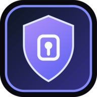

# Installing

[English](#english) · [فارسی](#فارسی)

---

## English

These packages are **not signed with a platform vendor's certificate**. Apple,
Microsoft and Google each sell one, and none of them is a statement about
whether software is safe — it is a statement about who paid. This project has
not, so macOS, Windows and Android each show a warning the first time you open
it, and each of them is dismissed once.

Everything you need to check the files yourself is published beside them:
`SHA256SUMS.txt` on the release, and the full source in this repository. An
unsigned build you can verify and compile yourself is a different thing from
one you simply have to trust.

### Which file

| You have | Download |
|---|---|
| Mac, Apple Silicon (M1–M4) | `P00RIJA Cryptography_2.35.0_aarch64.dmg` |
| Mac, Intel or either | `P00RIJA Cryptography_2.35.0_universal.dmg` |
| Windows 10/11, normal PC | `P00RIJA Cryptography_2.35.0_x64-setup.exe` |
| Windows on ARM | `P00RIJA Cryptography_2.35.0_arm64-setup.exe` |
| Android phone or tablet | `P00RIJA-Cryptography-2.35.0-universal.apk` |
| Debian, Ubuntu, Mint | `P00RIJA Cryptography_2.35.0_amd64.deb` |
| Fedora, RHEL, openSUSE | `P00RIJA Cryptography-2.35.0-1.x86_64.rpm` |
| Any Linux, nothing installed | `P00RIJA Cryptography_2.35.0_amd64.AppImage` |
| iPhone or iPad | no app file — see [iPhone and iPad](#iphone-and-ipad) |

On Linux, take the `aarch64` / `arm64` file instead if you are on a Raspberry Pi
or an ARM server.

### Verify what you downloaded

```bash
# macOS / Linux
shasum -a 256 -c SHA256SUMS.txt --ignore-missing
```

```powershell
# Windows PowerShell
Get-FileHash ".\P00RIJA Cryptography_2.35.0_x64-setup.exe" -Algorithm SHA256
```

The line it prints must match the one in `SHA256SUMS.txt`. If it does not, the
file changed on its way to you — delete it.

### macOS

Open the `.dmg` and drag the app to Applications as usual. The first time you
open it, macOS says the app **"is damaged and can't be opened"** or that it
cannot check it for malicious software. It is not damaged. That message is what
Gatekeeper says about any app downloaded without a paid Apple notarization.

**macOS 15 Sequoia and newer** — the old right-click → Open trick no longer
works:

1. Try to open the app once, and let the warning appear.
2. Apple menu →  **System Settings** → **Privacy & Security**.
3. Scroll to the bottom. There is a line naming the app, with **Open Anyway**.
4. Click it, then confirm with Touch ID or your password.

**macOS 14 Sonoma and older** — right-click (or Control-click) the app in
Applications, choose **Open**, then **Open** again in the dialog.

**If neither appears**, macOS quarantined the file. Remove the flag and open it
normally:

```bash
xattr -dr com.apple.quarantine "/Applications/P00RIJA Cryptography.app"
```

You only do this once. Updates from then on open without asking.

### Windows

Run the `-setup.exe`. Windows shows a blue box: **"Windows protected your PC"**.

1. Click **More info** — the small link in the box, easy to miss.
2. Click **Run anyway**.

That is SmartScreen reporting that this installer has no Extended Validation
certificate and has not yet been downloaded by enough people for Microsoft to
have formed an opinion. It is not a virus warning.

Some antivirus products flag new unsigned installers on the same reasoning. If
yours quarantines the file, check the SHA-256 above first; if it matches, the
file is exactly what was published here.

### Android

The `.apk` is signed with this project's own release key, which is what makes it
installable at all — Android refuses an unsigned package. It is not distributed
through Google Play, so the phone asks for permission once:

1. Open the `.apk` from your Downloads or your file manager.
2. Android says the browser or file manager **"is not allowed to install unknown
   apps"**. Tap **Settings**.
3. Turn on **Allow from this source**.
4. Go back and tap **Install**.

Play Protect may add a second panel offering to scan the app. **Install anyway**
is safe to choose; you can let it scan first if you prefer.

Keep the file. Because it does not come from Play, updates are installed the
same way, by opening a newer `.apk`.

### Linux

No warnings on any of these.

```bash
# Debian, Ubuntu, Mint
sudo apt install "./P00RIJA Cryptography_2.35.0_amd64.deb"

# Fedora, RHEL, openSUSE
sudo dnf install "./P00RIJA Cryptography-2.35.0-1.x86_64.rpm"

# Anywhere — nothing is installed, it just runs
chmod +x "P00RIJA Cryptography_2.35.0_amd64.AppImage"
"./P00RIJA Cryptography_2.35.0_amd64.AppImage"
```

Calls are unavailable in the Linux native build; everything else works. See
[docs/linux-webrtc.md](docs/linux-webrtc.md) for why, and use the web app in a
browser if you need calls on Linux.

### iPhone and iPad

There is no app file to download. Distributing an `.ipa` to someone else's
device requires a paid Apple Developer account, so iOS is served as the web app,
which is the whole suite with nothing removed:

1. Open the site in **Safari** — it has to be Safari, not Chrome.
2. Tap **Share** (the square with the arrow).
3. **Add to Home Screen**.

It then runs full screen with its own icon, works offline, and receives
background notifications.

### No install at all

Any desktop, nothing to agree to:

```bash
npx p00rija-cryptography@latest --pwa
```

That serves the app locally and opens it in a browser tab.

### Build it yourself instead

The surest answer to an unsigned binary is not to use it. Everything needed to
produce these exact packages is in this repository — see
[NATIVE_BUILD.md](NATIVE_BUILD.md) for desktop and [MOBILE_BUILD.md](MOBILE_BUILD.md)
for Android and iOS.

---

<div dir="rtl">

## فارسی

این بسته‌ها **با گواهی هیچ‌کدام از سازندگان سیستم‌عامل امضا نشده‌اند**. اپل،
مایکروسافت و گوگل هرکدام چنین گواهی‌ای می‌فروشند، و هیچ‌کدام دربارهٔ امن بودن
نرم‌افزار حرفی نمی‌زنند — دربارهٔ این حرف می‌زنند که چه کسی پول داده است. این
پروژه نداده، پس مک، ویندوز و اندروید هرکدام بار اول یک هشدار نشان می‌دهند، و هر
سه با یک‌بار رد کردن تمام می‌شوند.

هرچه برای بررسی خودِ فایل‌ها لازم است، کنارشان منتشر شده: `SHA256SUMS.txt` روی
همین انتشار، و کل کد منبع در همین مخزن. یک بیلد بدون امضا که بتوانی بررسی و
خودت کامپایلش کنی، چیز دیگری است از بیلدی که فقط باید به آن اعتماد کرد.

### کدام فایل

| اگر داری | دانلود کن |
|---|---|
| مک با تراشهٔ اپل (M1 تا M4) | `P00RIJA Cryptography_2.35.0_aarch64.dmg` |
| مک اینتل، یا هر دو | `P00RIJA Cryptography_2.35.0_universal.dmg` |
| ویندوز ۱۰/۱۱ معمولی | `P00RIJA Cryptography_2.35.0_x64-setup.exe` |
| ویندوز روی ARM | `P00RIJA Cryptography_2.35.0_arm64-setup.exe` |
| گوشی یا تبلت اندروید | `P00RIJA-Cryptography-2.35.0-universal.apk` |
| دبیان، اوبونتو، مینت | `P00RIJA Cryptography_2.35.0_amd64.deb` |
| فدورا، RHEL، openSUSE | `P00RIJA Cryptography-2.35.0-1.x86_64.rpm` |
| هر لینوکسی، بدون نصب | `P00RIJA Cryptography_2.35.0_amd64.AppImage` |
| آیفون یا آیپد | فایلی ندارد — [آیفون و آیپد](#آیفون-و-آیپد) را ببین |

روی لینوکس، اگر روی رزبری‌پای یا سرور ARM هستی، نسخهٔ `aarch64` / `arm64` را
بردار.

### درستی فایل را بررسی کن

```bash
# مک و لینوکس
shasum -a 256 -c SHA256SUMS.txt --ignore-missing
```

```powershell
# پاورشل ویندوز
Get-FileHash ".\P00RIJA Cryptography_2.35.0_x64-setup.exe" -Algorithm SHA256
```

خطی که چاپ می‌شود باید با خط متناظرش در `SHA256SUMS.txt` یکی باشد. اگر یکی
نبود، فایل در مسیر رسیدن به تو عوض شده — پاکش کن.

### مک

فایل `.dmg` را باز کن و برنامه را طبق معمول در Applications بینداز. بار اول که
بازش می‌کنی، مک می‌گوید برنامه **«آسیب دیده و باز نمی‌شود»** یا نمی‌تواند از نظر
بدافزار بررسی‌اش کند. آسیب ندیده. این همان چیزی است که Gatekeeper دربارهٔ هر
برنامه‌ای می‌گوید که بدون نوتاریزهٔ پولیِ اپل دانلود شده باشد.

**macOS ۱۵ Sequoia و بالاتر** — ترفند قدیمی راست‌کلیک → Open دیگر کار نمی‌کند:

۱. یک‌بار برنامه را باز کن و بگذار هشدار بیاید.
۲. منوی اپل →  **System Settings** → **Privacy & Security**.
۳. تا پایین صفحه برو. سطری با نام برنامه هست، کنارش **Open Anyway**.
۴. بزنش، بعد با Touch ID یا رمزت تأیید کن.

**macOS ۱۴ Sonoma و پایین‌تر** — روی برنامه در Applications راست‌کلیک (یا
Control-کلیک) کن، **Open** را بزن، و در پنجره‌ای که می‌آید دوباره **Open**.

**اگر هیچ‌کدام نیامد**، مک فایل را قرنطینه کرده. پرچم را بردار و عادی بازش کن:

```bash
xattr -dr com.apple.quarantine "/Applications/P00RIJA Cryptography.app"
```

این کار فقط یک‌بار است. از آن به بعد بدون پرسش باز می‌شود.

### ویندوز

فایل `-setup.exe` را اجرا کن. ویندوز یک کادر آبی نشان می‌دهد:
**«Windows protected your PC»**.

۱. روی **More info** بزن — لینک کوچکی داخل همان کادر است و راحت دیده نمی‌شود.
۲. روی **Run anyway** بزن.

این SmartScreen است که می‌گوید این نصب‌کننده گواهی EV ندارد و هنوز آن‌قدر دانلود
نشده که مایکروسافت دربارهٔ آن نظری داشته باشد. هشدار ویروس نیست.

بعضی آنتی‌ویروس‌ها هم به همین دلیل نصب‌کننده‌های تازه و بدون امضا را علامت
می‌زنند. اگر مال تو فایل را قرنطینه کرد، اول SHA-256 بالا را چک کن؛ اگر خواند،
فایل دقیقاً همانی است که اینجا منتشر شده.

### اندروید

فایل `.apk` با کلید انتشار خود این پروژه امضا شده، و همین است که اصلاً قابل
نصبش می‌کند — اندروید بستهٔ بدون امضا را قبول نمی‌کند. چون از Google Play
نمی‌آید، گوشی یک‌بار اجازه می‌خواهد:

۱. فایل `.apk` را از Downloads یا از فایل‌منیجر باز کن.
۲. اندروید می‌گوید مرورگر یا فایل‌منیجر **«اجازهٔ نصب برنامه‌های ناشناس ندارد»**.
   روی **Settings** بزن.
۳. گزینهٔ **Allow from this source** را روشن کن.
۴. برگرد و **Install** را بزن.

ممکن است Play Protect یک پنجرهٔ دوم بیاورد و پیشنهاد اسکن بدهد. زدن
**Install anyway** ایرادی ندارد؛ اگر ترجیح می‌دهی، بگذار اول اسکن کند.

فایل را نگه دار. چون از Play نمی‌آید، به‌روزرسانی هم به همین شکل انجام می‌شود:
با باز کردن یک `.apk` جدیدتر.

### لینوکس

هیچ‌کدام از این‌ها هشداری ندارند.

```bash
# دبیان، اوبونتو، مینت
sudo apt install "./P00RIJA Cryptography_2.35.0_amd64.deb"

# فدورا، RHEL، openSUSE
sudo dnf install "./P00RIJA Cryptography-2.35.0-1.x86_64.rpm"

# هر جایی — چیزی نصب نمی‌شود، فقط اجرا می‌شود
chmod +x "P00RIJA Cryptography_2.35.0_amd64.AppImage"
"./P00RIJA Cryptography_2.35.0_amd64.AppImage"
```

در نسخهٔ نیتیو لینوکس تماس کار نمی‌کند؛ باقی همه‌چیز کار می‌کند. دلیلش در
[docs/linux-webrtc.md](docs/linux-webrtc.md) آمده — اگر روی لینوکس به تماس نیاز
داری، از نسخهٔ وب در مرورگر استفاده کن.

### آیفون و آیپد

فایلی برای دانلود نیست. رساندن یک `.ipa` به دستگاه شخص دیگر به حساب توسعه‌دهندهٔ
پولی اپل نیاز دارد، پس iOS با نسخهٔ وب سرو می‌شود، که همان سوئیت کامل است بدون
هیچ کم‌وکاستی:

۱. سایت را در **سافاری** باز کن — حتماً سافاری، نه کروم.
۲. دکمهٔ **Share** (مربع با فلش) را بزن.
۳. **Add to Home Screen**.

از آن به بعد تمام‌صفحه با آیکن خودش اجرا می‌شود، آفلاین کار می‌کند، و اعلان
پس‌زمینه می‌گیرد.

### بدون هیچ نصبی

روی هر دسکتاپی، بدون اینکه چیزی را بپذیری:

```bash
npx p00rija-cryptography@latest --pwa
```

برنامه را به‌صورت محلی سرو می‌کند و در یک تب مرورگر باز می‌کند.

### یا خودت بسازش

مطمئن‌ترین پاسخ به یک باینری بدون امضا، استفاده نکردن از آن است. هرچه برای ساختن
دقیقاً همین بسته‌ها لازم است در همین مخزن هست — برای دسکتاپ
[NATIVE_BUILD.md](NATIVE_BUILD.md) و برای اندروید و iOS
[MOBILE_BUILD.md](MOBILE_BUILD.md) را ببین.

</div>
